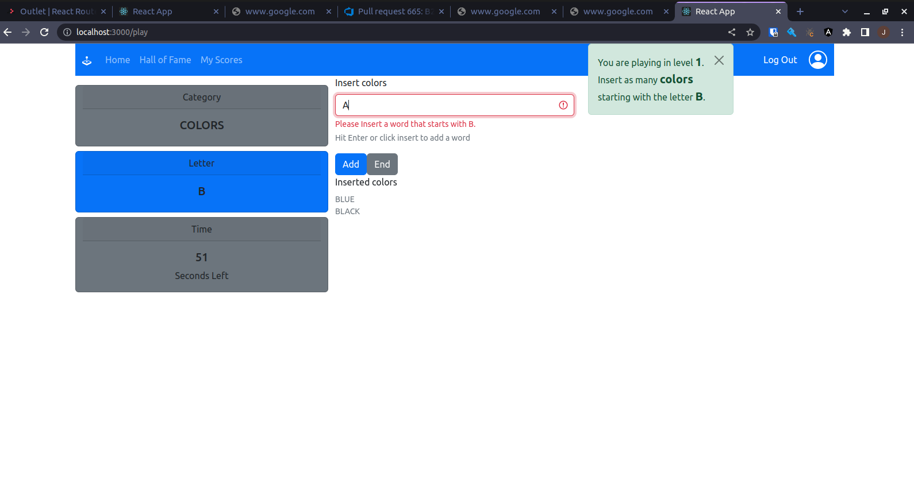

# Exam #3: "Categories"
## Student: s298351 VANEGAS JUAN 

## React Client Application Routes

- Route `/`: Init page, to allow the user to play or log in if logged out.
- Route `/play`: Playing page, the Categories game happens here.
- Route `/login`: Log in page, to allow user to log in if logged out.
- Route `/leaderboar`: Hall of fame page, shows the three best players by category.
- Route `/history`: User history page, shows user specific rounds.
- Route `*`: Default page, default page for non existing routes.

## API Server

- GET `/api/sessions/current`
  - No request parameters and no request body content
  - Cookie connect.sid required
  - Response body
  ```
    status: logged_in or logged_out 
    user: {
        id: number,
        username: string,
        name: string
      } or null
  ```
- DELETE `/api/sessions/current`
  - Cookie connect.sid required
  - No Response body

- POST `/api/sessions/current`
  - Request body
  ```
    {
      username: string(email),
      password: string
    }
  ```
  - No Response body
- POST `/api/score`
  - request body
  ```
    {
      category: string(colors,animals or countries),
      letter: string(),
      level: int(1 to 4),
      words: list
    } 
  ```
  - Response body
  ```
    {
      full_point_words: list
      half_point_words: list
      passed: boolean
      score: int    
    }
  ```
- POST `/api/rounds`
  - request body
  ```
    {
      category: string(colors,animals or countries),
      letter: string(),
      level: int(1 to 4),
      words: list,
      score: int
    } 
  ```
  - no response body
- GET `/api/rounds`
  - no request body no query parameters
  - response body
  ```
    [
      {
        category: string(colors,animals or countries),
        letter: string(),
        level: int(1 to 4),
        words: list,
        score: int,
        playedAt: string,
      },
      ...
    ]
  ```
  - no response body
- GET `/api/leaderboard`
  - no request body no query parameters
  - response body
  ```
    {
      category: string(colors,animals or countries),
      name: string,
      score: int,
    },
  ```

## Database Tables

- Table `users` - store user information and contains id, email, name, hash, salt 
- Table `rounds` - store logged-in users' rounds and contains id, letter, category, played_at, words, score, level, user_id
- Table `words` - store valid words and contains id, word, letter, category

## Main React Components

- `App` (in `App.js`): main component in charge of alerts and handlign routes
- `Page` (in `App.js`): componnent to standarize pages with the same Navigation Bar
  - `NavigationBar` (in `NavigationBar.js`): navigation bar to redirect and log in/out
  - `LoginPage` (in `Auth.js`): log in component (shown just if not logged in)
  - `DefaultRoute` (in `DefaultRoute.js`): default message for not existing routes
  - `Leaderboard` (in `Leaderboard.js`): component to show hall of fame
  - `UserHistory` (in `UserHistory.js`): component to show user previous rounds
  - `EntryPage` (in `EntryPage.js`): component to choose between play and loging in (if logged out)
    - `Game` (in `Game.js`): entry game component to show score or allow user to go to the game it self
      - `GamePage` (in `GamePage.js`): entry game component to show score or allow user to go to the game it self
        - `GameWords` (in `GameWords.js`): allows to insert words while shows game configuration
        - `GameInstructions` (in `GameInstructions.js`): alert to show the game instructions
        - `GameSettings` (in `GameSettings.js`): allows the user to know the choosen game settings
        - `Timer` (in `Timer.js`): timer shown during the game
      - `GameScore` (in `GameScore.js`): shows the final results
      - `SelectionPage` (in `SelectionPage.js`): User selects game configurations

## Screenshot



## Users Credentials

| email                 | password | name  |
|-----------------------|----------|-------|
| john.doe@polito.it    | password | John  |
| mario.rossi@polito.it | password | Mario |
| testuser@polito.it    | password | Test  |

